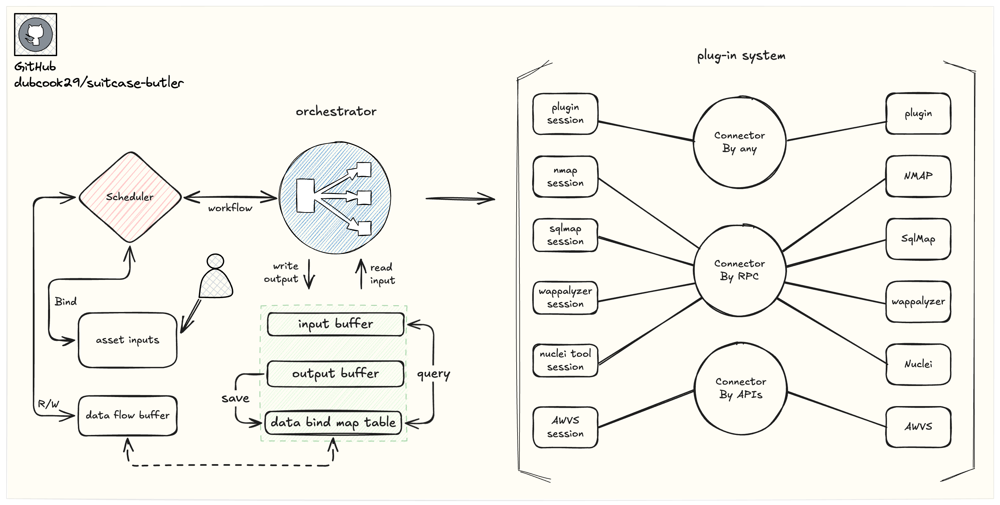

## first meeting
 
👋 Hi, glad you are following the 'Red-Team BUTLER' project!

Although I am not a professional developer, I do work in network security. I am not skilled in code design and do not understand excellent code practices. If the readability of the code makes you uncomfortable, I would like to say "sorry" first. my native language is Chinese, so please forgive me if my English expression is inappropriate.

At work, I need to use multiple tools and switch back and forth, and also need to retrieve and organize a lot of data, which limits my work efficiency, so I hope to have a lightweight automated system to complete part of my workflow. I can make a cup of coffee and use the "tool" to make a "work arrangement/plan", and when I finish the cup of coffee, I can see the "tool" complete the work and give me a simple and clear "work report". To this end, I have the idea of ​​developing this "tool" independently.

The current "BUTLER" is in active development, so don't expect it to work flawlessly.

I have several stages of ideas for its development. I will gradually improve this tool according to these ideas until it can finally become my "work assistant":

- **stage-1**：It helps users solve some complex tasks, arranges work plans according to users' pace and ideas, and allows users to develop custom plugins to solve work problems.
- **stage-2**：It provides users with a complete platform with a robust plugin ecosystem that can solve most problems encountered in their work and improve work efficiency through well-organized work plans.
- **stage-3**：We will continuously provide and optimize the plugin ecosystem for users, ensuring that it covers 60% of users' work methods and solves 60% of their work problems. At the same time, we will provide better services based on the AI-enabled system.
- **stage-4**：Users can schedule tasks in the time it takes to make a cup of coffee, and after finishing their coffee, the results will be presented to them. The user only needs to define the tasks; the system runs in the background.

I'm very happy to meet everyone on Github. We've already reached the "stage-1" stage, and I hope to use the open-source platform to communicate with more people and gain a better understanding of most of their needs and highly creative ideas.

If you have any good ideas, you can submit them through [GitHub Issues] or by contributing a pull request (PR) to the code.

> [!Warning]
> I will share the design and ideas behind this tool. Most of the translations were done from Chinese to English using translation software, so please forgive any difficulties in reading.

## idea

The original idea was to create a tool to call all the tools I need to use, that is, use a script to call multiple tools in sequence and output the results of multiple tools to a file, and then open the file to see the results of all tools, but such a script cannot completely integrate all the tools into one "Chain", and the input parameters of some tools cannot be defined when initially called. It is often the output of tool A that is used as the input of tool B. This is a common phenomenon. Many open source security tools now also support directly using the output of another tool as their own input parameters, for example: "`chaos -d hackerone.com | cdncheck -resp`", this idea formed the "autotool-script".

However, it still takes a lot of time to modify the "autotool-script" code and adjust the input and output between different tools, And because "autotool-script" is a fixed sequence, once the workflow changes, additional work is required to adjust the "autotool-script" code. For a long time, an unusually long "autotool-script" has been produced, which made the local tool environment increasingly complex.

"autotool-script" can really solve my problem at work, so that I don't have to switch back and forth between multiple tools. I only need to run the script to call all the tools I need and save the output of the tools into a file. Since the final output document does not have a unified format, it still needs to deal with a large amount of mixed "data". At the same time, in the face of every change in "work flow", it is still necessary to re-modify the code and spend a certain amount of time to verify its reliability.

For this reason, "autotool-script **pro**" has added richer parameter options. Through different parameter option processing, you can select one or more tool objects in the input of the script call, and select the input parameters of these tool objects. From this, "autotool-script **pro**" is like an intermediate layer through which each tool object can be called. At the same time, in order to call multiple tools, multiple tools can be called in the order of selection of the tool objects when inputting. This allows simple and flexible selection of tools and arrangement of the calling order of tools. "autotool-script **pro**" does not need to frequently adjust the code logic, but it is still limited and cannot flexibly handle different tools and cannot efficiently complete the synchronization of different tools.

After careful consideration, decided to build a complete automated script (system). In order to solve my pain points, I needed a "plug-in system" to manage different tools, a "connector" to call different tools (plug-ins), an "orchestrator" to arrange the calling relationships of different plug-ins, and a "data manager" to manage the data caching and exchange of each "task", and finally display the structured output of all data.

## design

### WMP

In this project, all plug-ins are referred to as "**WMP (Work Method Plugin)**", meaning **"a plug-in that performs a specific work method"**, examples include [`NMAP`](https://github.com/nmap/nmap) for port scanning, [`Sqlmap`](https://github.com/sqlmapproject/sqlmap) for SQL injection testing, [`Wappalyzer`](https://www.wappalyzer.com/) for web page fingerprinting, [`Nuclei`](https://github.com/projectdiscovery/nuclei) and [`AWVS`](https://www.acunetix.com/) for vulnerability scanning. It can also be the "logical" (functional) implementation of more tools and more work methods. Calling this WMP can help you complete a work method or work content.

WMP can be loaded via the [Go Plugin](https://pkg.go.dev/plugin), but considering more scenarios and development habits, a 'connector' has been added in between. 
In this project, different "connectors" can be used to connect to WMP in more scenarios, regardless of development environment or development language, as long as the two are connected by a network, you can browse the [`service/wmpci/connector/connect`](service/wmpci/connector/connect) source code to view the two 'connector' created so far, are [`built-in`](service/wmpci/connector/connect/built-in) and [`JSON-RPC`](service/wmpci/connector/connect/json-rpc) respectively (you can see `type BuiltinServer interface` through [built-in/server](service/wmpci/connector/connect/built-in/server.go), which loads WMP through "go plugin").

Developers can develop a `connector` themselves, which mainly includes two parts of logic: 'server' and 'client', WMPCI will connect to 'server' through 'client' of `connector`, developers must ensure that the `connector` they develop fully implements the [`WMPConnector`](service/wmpci/connector/connector.go) interface, can fully call 'server' through 'client', and writes a test file to verify that their client can establish a connection with 'server'.

When developing WMP in any scenario, you need to ensure that WMP can establish a connection with the 'connector', and you need to ensure that you can provide `WMPBasic`,`WMPCustom`,`WMPRequest`,`WMPResponse`([`WMPRegistrars`](service/wmpci/wmpci.go))，because this is what WMP must have.

Once the project is sufficiently mature, the "Connector and WMP Development Guide" will be published, guiding beginners to quickly customize their own 'wmp'. Before that, **any interested developers can join the project in advance, as there are many "WMP" implementations waiting to be developed.**

### Scheduler 

The scheduler is the logic for "work order orchestration", an "orchestration plan" will be created to control the order in which different plugins (connection sessions) are invoked.

It also maintains the input and output data generated during the scheduling process and allows for "binding" of plugin inputs and outputs within the "Orchestration Plan". all the code in [`Scheduler`](service/grid) is complete.

The [`Task`](service/grid/task.go) is responsible for handling "orchestration". It is used to define an "orchestration task", and multiple "orchestration tasks" are combined to form a complete "orchestration plan".

The entire orchestration plan is managed through [`Grid`](service/grid/grid.go). It calls the connection sessions of different plugins one by one through multiple orchestration tasks (orchestration plans), and constructs the input data according to the negotiation and caches the output data.

If the input and output data are bound and mapped in the orchestration plan by [`GridDataBind`](service/grid/bind.go), the runtime output data can also be used as input data.

### Workflow

Workflow manages the entire process of a task execution. [`Workflow Task`](service/workflow/task/) responsible for the management of a task, mainly used to agree on a scheduler (arrangement plan) and manage multiple assets (ID). [`workflow`](service/workflow/workflow/) responsible for the workflow of a specific task, which will involve starting the "Scheduler" and data caching, [`Workflow Manager`](service/workflow/manager/) is responsible for managing the state of all Workflows. It maintains a `Workflow session` pool to cache all Workflow states and also maintains a space responsible for the state of all `Workflow Task Runtime`.

Continuously updating Welcome to exchange ideas

